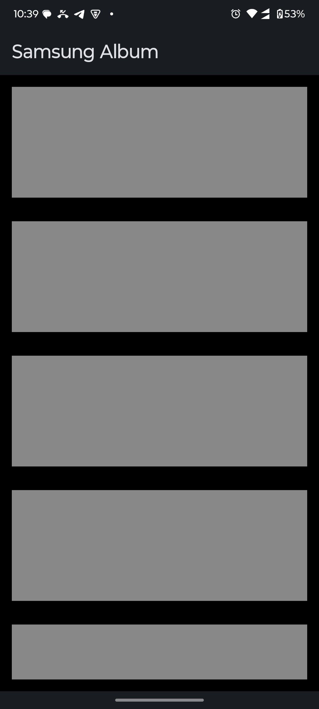
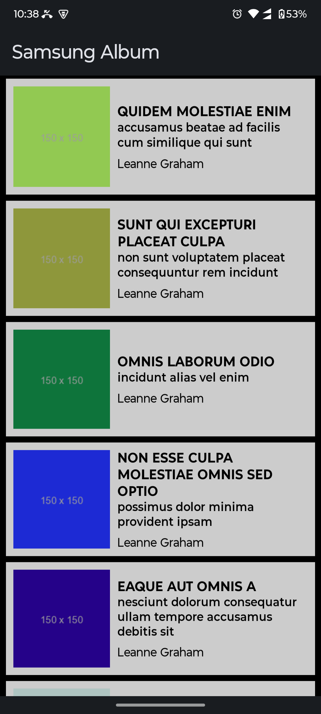
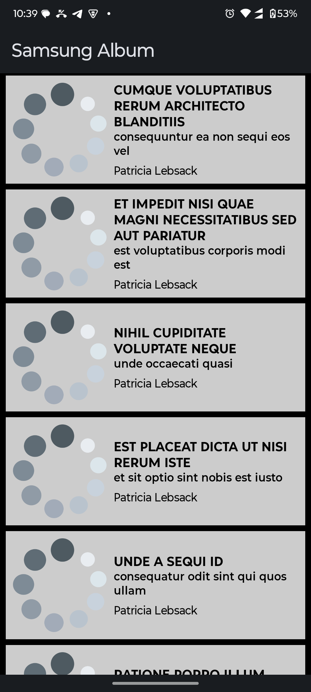

# This Android app displays a list of photos fetched from the [JSONPlaceholder API](https://jsonplaceholder.typicode.com/). 

## This project covers the followings, 

- **Clean Architecture and MVVM architecture**
- **Data fetching using background service**
- **Dependency injection using Hilt**
- **Jetpack compose**
- **SOLID Principle and OOP Principle**
- **Coroutines and reactive programming**
- **Test Coverage of 100% repositories, models and UI**
- **Shimmer Loading for animation**

## Layered Architecture

1. **Core**: Contains shared and reusable components.
2. **Data**: Handles all data-related operations, including network and local data sources.
3. **Domain**: Contains business logic and acts as an intermediary between the data and UI layers.a
4. **View**: The presentation layer, using Jetpack Compose for UI and ViewModel for state management.
5. **DI**: Configures Dependency Injection using Hilt.
6. **Test**: Contains all the tests and unit testing for the application. 

## Screenshots

  
  
  

